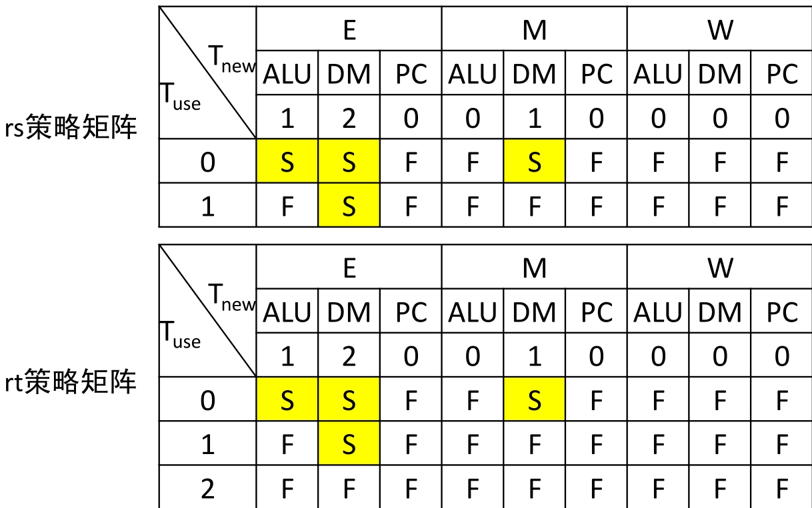
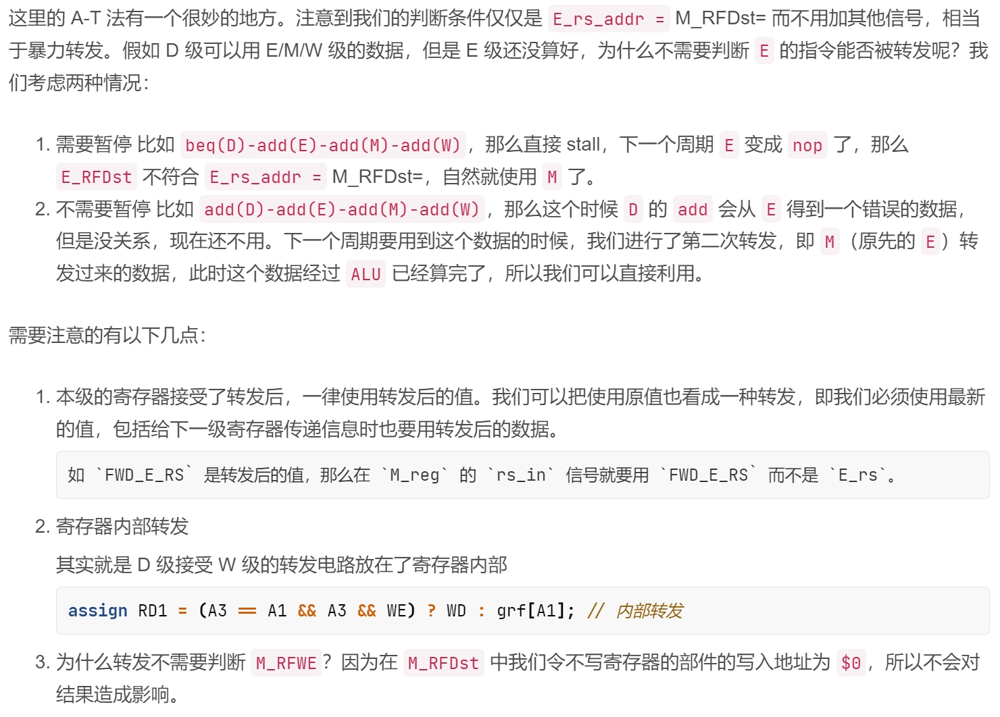

# p5设计文档

***


## 一、模块规格

与p4之间的差异：

### 1.Controller

* 去掉splitter，直接在Controller中对指令进行解码

* Controller中的RegA3Sel直接更改为GRFA3

* 在Controller中增添D级$T_{use}$和E、M、W级$T_{new}$信号

### 2.GRF

* 新增内部转发（W级到D级）

* 去掉WE信号，不写入时令A3端口为0即可

### 3.NPC

* 同时输入F、D两级的PC，前者用于跳转F_PC+4，后者用于流水PC的值

* 取消输出PC+4的值

### 4.CtrlForward（新增）

* 用于集中处理转发的选择

### 5.CtrlStall（新增）

* 用于集中处理暂停的控制信号

### 6.CtrlGRFWD（新增）

* 用于集中处理各级向其他地方转发的值（实际为各级指令向GRF写入的内容）

* 多数与p4中的多路选择器一致

## 二、T模型

> 转发：$T_{use}\geq T_{new}$
>
> 暂停：$T_{use}< T_{new}$
>
> 不需要写寄存器的指令，记$T_{new}=0$，即立刻就有新数据，是不会产生暂停的
>
> 不需要用寄存器的指令，记$T_{use}=3$，即很久之后才会用，是不会产生暂停的

| 指令  | $D\_T_{use}\_rs$ | $D\_T_{use}\_rt$ | $E\_T_{new}$ | $M\_T_{new}$ | $W\_T_{new}$ |
| ----- | ---------------- | ---------------- | ------------ | ------------ | ------------ |
| `add` | 1                | 1                | 1            | 0            | 0            |
| `sub` | 1                | 1                | 1            | 0            | 0            |
| `ori` | 1                | 3                | 1            | 0            | 0            |
| `lui` | 3                | 3                | 1            | 0            | 0            |
| `lw`  | 1                | 3                | 2            | 1            | 0            |
| `sw`  | 1                | 2                | 0            | 0            | 0            |
| `beq` | 0                | 0                | 0            | 0            | 0            |
| `jr`  | 0                | 3                | 0            | 0            | 0            |
| `jal` | 3                | 3                | 0            | 0            | 0            |



>  阻塞的操作：
>
> - 冻结PC的值
> - 冻结D级流水线
> - 清零E级流水线


## 三、A模型

| 转发输出 | 转发接收 | 种类                         |
| -------- | -------- | ---------------------------- |
| W        | D        | GRF内部转发                  |
| E        | D        | `jal`：转发`$31`的值（PC+8） |
| M        | D        |                              |
| M        | E        |                              |
| W        | E        |                              |
| W        | M        |                              |

> 接受端可以接受数据的条件为：
>
> 1. 供给端的寄存器地址与当前的相同
> 2. 当前需要的地址不为 0
> 3. 供给端可以转发（使用无脑转发，所以不需要考虑）
> 4. 供给端的指令会写数据（如果不写数据则令写入地址为 0，所以不需要考虑）



## 四、思考题

1. 我们使用提前分支判断的方法尽早产生结果来减少因不确定而带来的开销，但实际上这种方法并非总能提高效率，请从流水线冒险的角度思考其原因并给出一个指令序列的例子。

   > 在D级增加CMP提前产生分支结果，使得其$T_{use}$为0，若先前的指令需要写入寄存器即$T_{new}$大于0，则会造成阻塞，从而抵消提前的周期。
   >
   > ```verilog
   > add $t0, $t0, $0
   > beq $t0, $0, label
   > ```

2. 因为延迟槽的存在，对于 jal 等需要将指令地址写入寄存器的指令，要写回 PC + 8，请思考为什么这样设计？

   > `jal`的下一条指令肯定要执行，而`jal`在D级判断是否跳转，若返回PC+4，则此时F级中的指令会被重复执行。

3. 我们要求所有转发数据都来源于流水寄存器而不能是功能部件（如 DM、ALU），请思考为什么？

   > 若采取功能部件转发，则会有更多的控制信号和转发数据，顶层模块会变得很复杂。

4. 我们为什么要使用 GPR 内部转发？该如何实现？

   > ~~gxp课上说不要用内部转发~~
   >
   > 在GRF内部RD1、RD2输出端口选择输出WD还是Reg[A1]或Reg[A2]即可。

5. 我们转发时数据的需求者和供给者可能来源于哪些位置？共有哪些转发数据通路？

   > 供给者：
   >
   > * E级向GRF写入的PC+8（`jal`专用）
   > * M级新增ALUOut
   > * W级新增DmRD
   >
   > 转发数据通路：
   >
   > * E、M、W向D
   > * M、W向E
   > * W向M

6. 在课上测试时，我们需要你现场实现新的指令，对于这些新的指令，你可能需要在原有的数据通路上做哪些扩展或修改？提示：你可以对指令进行分类，思考每一类指令可能修改或扩展哪些位置。

   > * Controller中增添指令，进行解码
   > * 若有不同于先前指令的数据通路，则要添加MUX

7. 简要描述你的译码器架构，并思考该架构的优势以及不足。

   > * 在译码器即Controller中进行指令的解码，得到该条指令的选择信号、$T_{use}$和$T_{new}$信号
   >
   > * 采取分布式译码，减少顶层连线和流水，但增加实例化次数

## 五、测试

1.使用教程所给样例进行测试

```
0x0000000000003000:  34 1C 00 00    ori $gp, $zero, 0
0x0000000000003004:  34 1D 00 00    ori $sp, $zero, 0
0x0000000000003008:  34 01 10 10    ori $at, $zero, 0x1010
0x000000000000300c:  3C 02 87 23    lui $v0, 0x8723
0x0000000000003010:  34 03 78 56    ori $v1, $zero, 0x7856
0x0000000000003014:  3C 04 85 FF    lui $a0, 0x85ff
0x0000000000003018:  34 05 00 01    ori $a1, $zero, 1
0x000000000000301c:  3C 06 FF FF    lui $a2, 0xffff
0x0000000000003020:  34 07 FF FF    ori $a3, $zero, 0xffff
0x0000000000003024:  00 22 08 20    add $at, $at, $v0
0x0000000000003028:  00 23 48 20    add $t1, $at, $v1
0x000000000000302c:  00 22 40 22    sub $t0, $at, $v0
0x0000000000003030:  00 E0 00 22    sub $zero, $a3, $zero
0x0000000000003034:  13 91 00 03    beq $gp, $s1, 0x3044
0x0000000000003038:  00 00 00 00    nop 
0x000000000000303c:  10 00 00 15    b   0x3094
0x0000000000003040:  00 00 00 00    nop 
0x0000000000003044:  10 22 00 13    beq $at, $v0, 0x3094
0x0000000000003048:  00 00 00 00    nop 
0x000000000000304c:  34 02 00 0C    ori $v0, $zero, 0xc
0x0000000000003050:  00 00 00 00    nop 
0x0000000000003054:  00 00 00 00    nop 
0x0000000000003058:  00 00 00 00    nop 
0x000000000000305c:  0C 00 0C 1B    jal 0x306c
0x0000000000003060:  AC 41 00 00    sw  $at, ($v0)
0x0000000000003064:  10 00 00 0B    b   0x3094
0x0000000000003068:  00 22 08 20    add $at, $at, $v0
0x000000000000306c:  00 22 08 20    add $at, $at, $v0
0x0000000000003070:  00 22 08 20    add $at, $at, $v0
0x0000000000003074:  00 22 08 20    add $at, $at, $v0
0x0000000000003078:  AC 5F 00 00    sw  $ra, ($v0)
0x000000000000307c:  8C 41 00 00    lw  $at, ($v0)
0x0000000000003080:  00 00 00 00    nop 
0x0000000000003084:  00 00 00 00    nop 
0x0000000000003088:  00 00 00 00    nop 
0x000000000000308c:  00 20 00 08    jr  $at
0x0000000000003090:  AC 5F 00 00    sw  $ra, ($v0)
0x0000000000003094:  10 00 FF FF    b   0x3094
0x0000000000003098:  00 00 00 00    nop 
```

2.使用同班大佬写的自动测评机进行测试

3.考虑特殊情况进行针对测试

* `jal`延迟槽内读取`$31`的值
* `beq`前对需要比较的寄存器进行写入操作
* `lw`+`sw`
